# Cheat Sheet
|                                   iconHome                                  |                       iconHome2                      |                            iconHome3                          |                               iconHome4                             |                               iconHome5                             |
| :------------------------------------------------------------------------------------------------------------: | :---------------------------------------------------------------------------------------: | :------------------------------------------------------------------------------------------------: | :------------------------------------------------------------------------------------------------------: | :------------------------------------------------------------------------------------------------------: |
|                                  iconHome6                                |                    iconBathtub                   |                    iconToothbrush                   |                                  iconBed                                |                               iconCouch                             |
|                                 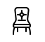 iconChair                                |                         iconCity                       |                      iconApartment                    |                             iconPencil                            |                            iconPencil2                          |
|                                     iconPen                                   |                    iconPencil3                   |                          iconEraser                         |                            iconPencil4                          |                            iconPencil5                          |
|                               iconFeather                             |                   iconFeather2                 |                       iconFeather3                      |                                iconPen2                               |                             iconPenAdd                            |
|                            iconPenRemove                          |                      iconVector                    |                             iconPen3                            |                                iconBlog                               |                              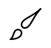 iconBrush                             |
|                                iconBrush2                               |                       iconSpray                      |                   iconPaintRoller                 |                               iconStamp                             |                                iconTape                               |
|                             iconDeskTape                            |                    iconTexture                   |                    iconEyeDropper                   |                            iconPalette                          |                    iconColorSampler                   |
|                                iconBucket                               |                   iconGradient                 |                      iconGradient2                    |                         iconMagicWand                       |                             iconMagnet                            |
|                         iconPencilRuler                       |             iconPencilRuler2           |                         iconCompass                       |                                  iconAim                                |                                  iconGun                                |
|                                iconBottle                               |                         iconDrop                       |                   iconDropCrossed                 |                               iconDrop2                             |                                iconSnow                               |
|                                  iconSnow2                                |                        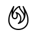 iconFire                       |                         iconLighter                       |                              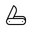 iconKnife                             |                             iconDagger                            |
|                                iconTissue                               |              iconToiletPaper             |                             iconPoop                            |                          iconUmbrella                         |                         iconUmbrella2                       |
|                                  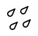 iconRain                                  |                    iconTornado                   |                             iconWind                            |                                  iconFan                                |                          iconContrast                         |
|                             iconSunSmall                            |                          iconSun                         |                             iconSun2                            |                                iconMoon                               |                               iconCloud                             |
|                         iconCloudUpload                       |           iconCloudDownload          |                      iconCloudRain                    |                iconCloudHailstones              |                         iconCloudSnow                       |
|                          iconCloudWindy                         |                    iconSunWind                   |                       iconCloudFog                      |                          iconCloudSun                         |                 iconCloudLightning                |
|                            iconCloudSync                          |                 iconCloudLock                |                      iconCloudGear                    |                       iconCloudAlert                      |                       iconCloudCheck                      |
|                          iconCloudCross                         |             iconCloudCrossed           |                iconCloudDatabase              |                          iconDatabase                         |                      iconDatabaseAdd                    |
|                    iconDatabaseRemove                   |             iconDatabaseLock           |             iconDatabaseRefresh           |                   iconDatabaseCheck                 |                iconDatabaseHistory              |
|                    iconDatabaseUpload                   |       iconDatabaseDownload     |                          iconServer                         |                             iconShield                            |                      iconShieldCheck                    |
|                         iconShieldAlert                       |              iconShieldCross             |                             iconLock                            |                    iconRotationLock                   |                             iconUnlock                            |
|                                     iconKey                                   |                    iconKeyHole                   |                      iconToggleOff                    |                          iconToggleOn                         |                                  iconCog                                |
|                                   iconCog2                                  |                      iconWrench                    |                   iconScrewdriver                 |                    iconHammerWrench                   |                             iconHammer                            |
|                                     iconSaw                                   |                          iconAxe                         |                             iconAxe2                            |                             iconShovel                            |                            iconPickaxe                          |
|                               iconFactory                             |                   iconFactory2                 |                         iconRecycle                       |                               iconTrash                             |                             iconTrash2                            |
|                                iconTrash3                               |                       iconBroom                      |                             iconGame                            |                            iconGamepad                          |                          iconJoystick                         |
|                                   iconDice                                  |                      iconSpades                    |                       iconDiamonds                      |                               iconClubs                             |                             iconHearts                            |
|                                  iconHeart                                |                         iconStar                       |                       iconStarHalf                      |                         iconStarEmpty                       |                       iconStarFilled                      |
|                                   iconFlag                                  |                       iconFlag2                      |                            iconFlag3                          |                      iconMailboxFull                    |                    iconMailboxEmpty                   |
|                                iconAtSign                               |                   iconEnvelope                 |                 iconEnvelopeOpen                |                         iconPaperclip                       |                       iconPaperPlane                      |
|                                 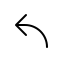 iconReply                                |                   iconReplyAll                 |                            iconInbox                          |                             iconInbox2                            |                             iconOutbox                            |
|                                     iconBox                                   |                    iconArchive                   |                       iconArchive2                      |                            iconDrawers                          |                          iconDrawers2                         |
|                             iconDrawers3                            |                          iconEye                         |                    iconEyeCrossed                   |                            iconEyePlus                          |                          iconEyeMinus                         |
|                          iconBinoculars                         |              iconBinoculars2             |                               iconHdd                             |                            iconHddDown                          |                               iconHddUp                             |
|                          iconFloppyDisk                         |                         iconDisc                       |                            iconTape2                          |                            iconPrinter                          |                          iconShredder                         |
|                            iconFileEmpty                          |                    iconFileAdd                   |                      iconFileCheck                    |                          iconFileLock                         |                               iconFiles                             |
|                                   iconCopy                                  |                    iconCompare                   |                          iconFolder                         |                    iconFolderSearch                   |                       iconFolderPlus                      |
|                         iconFolderMinus                       |          iconFolderDownload        |                 iconFolderUpload                |                       iconFolderStar                      |                      iconFolderHeart                    |
|                          iconFolderUser                         |             iconFolderShared           |                   iconFolderMusic                 |                   iconFolderPicture                 |                       iconFolderFilm                      |
|                             iconScissors                            |                       iconPaste                      |              iconClipboardEmpty             |                iconClipboardPencil              |                   iconClipboardText                 |
|                    iconClipboardCheck                   |           iconClipboardDown          |                iconClipboardLeft              |                 iconClipboardAlert                |                   iconClipboardUser                 |
|                             iconRegister                            |                       iconEnter                      |                             iconExit                            |                             iconPapers                            |                                iconNews                               |
|                               iconReading                             |                iconTypewriter              |                       iconDocument                      |                         iconDocument2                       |                   iconGraduationHat                 |
|                               iconLicense                             |                   iconLicense2                 |                    iconMedalEmpty                   |                       iconMedalFirst                      |                      iconMedalSecond                    |
|                          iconMedalThird                         |                      iconPodium                    |                          iconTrophy                         |                            iconTrophy2                          |                         iconMusicNote                       |
|                          iconMusicNote2                         |                iconMusicNote3              |                       iconPlaylist                      |                      iconPlaylistAdd                    |                             iconGuitar                            |
|                               iconTrumpet                             |                       iconAlbum                      |                         iconShuffle                       |                         iconRepeatOne                       |                             iconRepeat                            |
|                          iconHeadphones                         |                    iconHeadset                   |                   iconLoudspeaker                 |                         iconEqualizer                       |                            iconTheater                          |
|                          icon_3dGlasses                         |                      iconTicket                    |                 iconPresentation                |                                iconPlay                               |                          iconFilmPlay                         |
|                      iconClapboardPlay                    |                       iconMedia                      |                             iconFilm                            |                               iconFilm2                             |                    iconSurveillance                   |
|                      iconSurveillance2                    |                      iconCamera                    |                iconCameraCrossed              |                       iconCameraPlay                      |                         iconTimeLapse                       |
|                                iconRecord                               |                    iconCamera2                   |                    iconCameraFlip                   |                          iconPanorama                         |                       iconTimeLapse2                      |
|                               iconShutter                             |                   iconShutter2                 |                iconFaceDetection              |                               iconFlare                             |                             iconConvex                            |
|                               iconConcave                             |                    iconPicture                   |                       iconPicture2                      |                          iconPicture3                         |                          iconPictures                         |
|                                   iconBook                                  |                 iconAudioBook                |                            iconBook2                          |                          iconBookmark                         |                         iconBookmark2                       |
|                                  iconLabel                                |                    iconLibrary                   |                       iconLibrary2                      |                          iconContacts                         |                            iconProfile                          |
|                             iconPortrait                            |                 iconPortrait2                |                             iconUser                            |                          iconUserPlus                         |                         iconUserMinus                       |
|                             iconUserLock                            |                       iconUsers                      |                          iconUsers2                         |                         iconUsersPlus                       |                       iconUsersMinus                      |
|                            iconGroupWork                          |                       iconWoman                      |                               iconMan                             |                                iconBaby                               |                               iconBaby2                             |
|                                  iconBaby3                                |                iconBabyBottle              |                             iconWalk                            |                       iconHandWaving                      |                          iconHandwave                         |
|                                   iconJump                                  |                          iconRun                         |                          iconWoman2                         |                                iconMan2                               |                          iconManWoman                         |
|                                iconHeight                               |                      iconWeight                    |                            iconScale                          |                             iconButton                            |                             iconBowTie                            |
|                                     iconTie                                   |                       iconSocks                      |                             iconShoe                            |                               iconShoes                             |                                  iconHat                                |
|                                 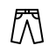 iconPants                                |                      iconShorts                    |                      iconFlipFlops                    |                               iconShirt                             |                             iconHanger                            |
|                               iconLaundry                             |                       iconStore                      |                         iconHaircut                       |                          iconStore_24                         |                            iconBarcode                          |
|                             iconBarcode2                            |                   iconBarcode3                 |                         iconCashier                       |                                  iconBag                                |                                iconBag2                               |
|                                   iconCart                                  |                 iconCartEmpty                |                       iconCartFull                      |                          iconCartPlus                         |                         iconCartPlus2                       |
|                               iconCartAdd                             |                iconCartRemove              |                 iconCartExchange                |                                  iconTag                                |                                iconTags                               |
|                               iconReceipt                             |                      iconWallet                    |                    iconCreditCard                   |                       iconCashDollar                      |                          iconCashEuro                         |
|                            iconCashPound                          |                    iconCashYen                   |                      iconBagDollar                    |                            iconBagEuro                          |                          iconBagPound                         |
|                                iconBagYen                               |                iconCoinDollar              |                       iconCoinEuro                      |                         iconCoinPound                       |                            iconCoinYen                          |
|                          iconCalculator                         |              iconCalculator2             |                          iconAbacus                         |                               iconVault                             |                         iconTelephone                       |
|                            iconPhoneLock                          |                 iconPhoneWave                |                    iconPhonePause                   |                   iconPhoneOutgoing                 |                   iconPhoneIncoming                 |
|                          iconPhoneInOut                         |                iconPhoneError              |                       iconPhoneSip                      |                         iconPhonePlus                       |                       iconPhoneMinus                      |
|                            iconVoicemail                          |                         iconDial                       |                    iconTelephone2                   |                            iconPushpin                          |                          iconPushpin2                         |
|                            iconMapMarker                          |           iconMapMarkerUser          |                iconMapMarkerDown              |                 iconMapMarkerCheck                |              iconMapMarkerCrossed             |
|                                  iconRadar                                |                   iconCompass2                 |                               iconMap                             |                                iconMap2                               |                          iconLocation                         |
|                             iconRoadSign                            |           iconCalendarEmpty          |                iconCalendarCheck              |                   iconCalendarCross                 |                      iconCalendar_31                    |
|                       iconCalendarFull                      |          iconCalendarInsert        |                 iconCalendarText                |                    iconCalendarUser                   |                               iconMouse                             |
|                            iconMouseLeft                          |                iconMouseRight              |                      iconMouseBoth                    |                          iconKeyboard                         |                       iconKeyboardUp                      |
|                       iconKeyboardDown                      |                      iconDelete                    |                    iconSpellCheck                   |                             iconEscape                            |                             iconEnter2                            |
|                                iconScreen                               |              iconAspectRatio             |                          iconSignal                         |                       iconSignalLock                      |                         iconSignal_80                       |
|                            iconSignal_60                          |                 iconSignal_40                |                      iconSignal_20                    |                          iconSignal_0                         |                   iconSignalBlocked                 |
|                                     iconSim                                   |              iconFlashMemory             |                       iconUsbDrive                      |                               iconPhone                             |                       iconSmartphone                      |
|        iconSmartphoneNotification       |  iconSmartphoneVibration |             iconSmartphoneEmbed           |                iconSmartphoneWaves              |                             iconTablet                            |
|                               iconTablet2                             |                      iconLaptop                    |                   iconLaptopPhone                 |                            iconDesktop                          |                             iconLaunch                            |
|                                iconNewTab                               |                      iconWindow                    |                            iconCable                          |                             iconCable2                            |                                   iconTv                                  |
|                                  iconRadio                                |           iconRemoteControl          |                   iconPowerSwitch                 |                               iconPower                             |                    iconPowerCrossed                   |
|                           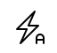 iconFlashAuto                          |                         iconLamp                       |                   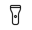 iconFlashlight                   |                         iconLampshade                       |                                iconCord                               |
|                                iconOutlet                               |             iconBatteryPower           |                 iconBatteryEmpty                |                    iconBatteryAlert                   |                    iconBatteryError                   |
|                         iconBatteryLow1                       |              iconBatteryLow2             |                   iconBatteryLow3                 |                      iconBatteryMid1                    |                      iconBatteryMid2                    |
|                         iconBatteryMid3                       |              iconBatteryFull             |             iconBatteryCharging           |              iconBatteryCharging2             |              iconBatteryCharging3             |
|                 iconBatteryCharging4                |       iconBatteryCharging5     |           iconBatteryCharging6          |              iconBatteryCharging7             |                                iconChip                               |
|                               iconChipX64                             |                    iconChipX86                   |                          iconBubble                         |                            iconBubbles                          |                       iconBubbleDots                      |
|                         iconBubbleAlert                       |          iconBubbleQuestion        |                    iconBubbleText                   |                    iconBubblePencil                   |                   iconBubblePicture                 |
|                         iconBubbleVideo                       |                iconBubbleUser              |                   iconBubbleQuote                 |                      iconBubbleHeart                    |                 iconBubbleEmoticon                |
|                 iconBubbleAttachment                |              iconPhoneBubble             |                      iconQuoteOpen                    |                       iconQuoteClose                      |                                  iconDna                                |
|                          iconHeartPulse                         |                      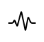 iconPulse                      |                         iconSyringe                       |                              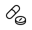 iconPills                             |                          iconFirstAid                         |
|                             iconLifebuoy                            |                    iconBandage                   |                       iconBandages                      |                      iconThermometer                    |                       iconMicroscope                      |
|                                  iconBrain                                |                      iconBeaker                    |                            iconSkull                          |                                iconBone                               |                    iconConstruction                   |
|                 iconConstructionCone                |                   iconPieChart                 |                      iconPieChart2                    |                               iconGraph                             |                      iconChartGrowth                    |
|                            iconChartBars                          |           iconChartSettings          |                             iconCake                            |                                iconGift                               |                            iconBalloon                          |
|                                   iconRank                                  |                       iconRank2                      |                            iconRank3                          |                               iconCrown                             |                               iconLotus                             |
|                               iconDiamond                             |                   iconDiamond2                 |                       iconDiamond3                      |                          iconDiamond4                         |                      iconLinearicons                    |
|                                iconTeacup                               |                      iconTeapot                    |                           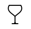 iconGlass                          |                            iconBottle2                          |                   iconGlassCocktail                 |
|                                iconGlass2                               |                      iconDinner                    |                         iconDinner2                       |                                iconChef                               |                             iconScale2                            |
|                                     iconEgg                                   |                         iconEgg2                       |                             iconEggs                            |                            iconPlatter                          |                              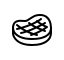 iconSteak                             |
|                            iconHamburger                          |                      iconHotdog                    |                            iconPizza                          |                            iconSausage                          |                            iconChicken                          |
|                                   iconFish                                  |                      iconCarrot                    |                          iconCheese                         |                               iconBread                             |                          iconIceCream                         |
|                            iconIceCream2                          |                       iconCandy                      |                       iconLollipop                      |                       iconCoffeeBean                      |                         iconCoffeeCup                       |
|                                iconCherry                               |                      iconGrapes                    |                          iconCitrus                         |                               iconApple                             |                                iconLeaf                               |
|                            iconLandscape                          |                   iconPineTree                 |                             iconTree                            |                             iconCactus                            |                                  iconPaw                                |
|                            iconFootprint                          |                 iconSpeedSlow                |                   iconSpeedMedium                 |                         iconSpeedFast                       |                             iconRocket                            |
|                       iconRocketFilled                      |                    iconHammer2                   |                         iconBalance                       |                         iconBriefcase                       |                   iconLuggageWeight                 |
|                                  iconDolly                                |                       iconPlane                      |                 iconPlaneCrossed                |                       iconHelicopter                      |                   iconTrafficLights                 |
|                                  iconSiren                                |                         iconRoad                       |                          iconEngine                         |                      iconOilPressure                    |           iconCoolantTemperature          |
|                          iconCarBattery                         |                          iconGas                         |                          iconGallon                         |                    iconTransmission                   |                                  iconCar                                |
|                               iconCarWash                             |                   iconCarWash2                 |                               iconBus                             |                                iconBus2                               |                                iconCar2                               |
|                               iconParking                             |                    iconCarLock                   |                             iconTaxi                            |                          iconCarSiren                         |                          iconCarWash3                         |
|                             iconCarWash4                            |                 iconAmbulance                |                            iconTruck                          |                            iconTrailer                          |                       iconScaleTruck                      |
|                                  iconTrain                                |                         iconShip                       |                            iconShip2                          |                             iconAnchor                            |                                iconBoat                               |
|                               iconBicycle                             |                   iconBicycle2                 |                       iconDumbbell                      |                       iconBenchPress                      |                                iconSwim                               |
|                             iconFootball                            |              iconBaseballBat             |                       iconBaseball                      |                             iconTennis                            |                            iconTennis2                          |
|                             iconPingPong                            |                     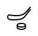 iconHockey                    |                          icon_8ball                         |                            iconBowling                          |                      iconBowlingPins                    |
|                                   iconGolf                                  |                       iconGolf2                      |                         iconArchery                       |                         iconSlingshot                       |                             iconSoccer                            |
|                          iconBasketball                         |                         iconCube                       |                      icon_3dRotate                    |                             iconPuzzle                            |                            iconGlasses                          |
|                             iconGlasses2                            |           iconAccessibility          |                    iconWheelchair                   |                                iconWall                               |                               iconFence                             |
|                                  iconWall2                                |                       iconIcons                      |                 iconResizeHandle                |                             iconIcons2                            |                             iconSelect                            |
|                               iconSelect2                             |                    iconSiteMap                   |                            iconEarth                          |                         iconEarthLock                       |                            iconNetwork                          |
|                         iconNetworkLock                       |                      iconPlanet                    |                            iconHappy                          |                               iconSmile                             |                                iconGrin                               |
|                                iconTongue                               |                          iconSad                         |                             iconWink                            |                               iconDream                             |                            iconShocked                          |
|                             iconShocked2                            |                    iconTongue2                   |                         iconNeutral                       |                         iconHappyGrin                       |                                iconCool                               |
|                                     iconMad                                   |                   iconGrinEvil                 |                             iconEvil                            |                                  iconWow                                |                            iconAnnoyed                          |
|                            iconWondering                          |                   iconConfused                 |                          iconZipped                         |                             iconGrumpy                            |                          iconMustache                         |
|                 iconTombstoneHipster                |                 iconTombstone                |                            iconGhost                          |                    iconGhostHipster                   |                         iconHalloween                       |
|                            iconChristmas                          |                 iconEasterEgg                |                      iconMustache2                    |                iconMustacheGlasses              |                                iconPipe                               |
|                                  iconAlarm                                |                   iconAlarmAdd                 |                   iconAlarmSnooze                 |                    iconAlarmRinging                   |                          iconBullhorn                         |
|                               iconHearing                             |                iconVolumeHigh              |                 iconVolumeMedium                |                         iconVolumeLow                       |                             iconVolume                            |
|                                   iconMute                                  |                          iconLan                         |                             iconLan2                            |                                iconWifi                               |                          iconWifiLock                         |
|                         iconWifiBlocked                       |                    iconWifiMid                   |                         iconWifiLow                       |                          iconWifiLow2                         |                         iconWifiAlert                       |
|                       iconWifiAlertMid                      |             iconWifiAlertLow           |                iconWifiAlertLow2              |                             iconStream                            |                      iconStreamCheck                    |
|                         iconStreamError                       |              iconStreamAlert             |                iconCommunication              |        iconCommunicationCrossed       |                         iconBroadcast                       |
|                               iconAntenna                             |                 iconSatellite                |                    iconSatellite2                   |                                  iconMic                                |                            iconMicMute                          |
|                                   iconMic2                                  |                iconSpotlights              |                      iconHourglass                    |                            iconLoading                          |                          iconLoading2                         |
|                             iconLoading3                            |                    iconRefresh                   |                       iconRefresh2                      |                                iconUndo                               |                                iconRedo                               |
|                                  iconJump2                                |                       iconUndo2                      |                            iconRedo2                          |                                iconSync                               |                       iconRepeatOne2                      |
|                         iconSyncCrossed                       |                       iconSync2                      |                    iconRepeatOne3                   |                    iconSyncCrossed2                   |                             iconReturn                            |
|                               iconReturn2                             |                      iconRefund                    |                         iconHistory                       |                          iconHistory2                         |                         iconSelfTimer                       |
|                                  iconClock                                |                      iconClock2                    |                          iconClock3                         |                               iconWatch                             |                             iconAlarm2                            |
|                            iconAlarmAdd2                          |             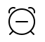 iconAlarmRemove             |                    iconAlarmCheck                   |                       iconAlarmError                      |                               iconTimer                             |
|                       iconTimerCrossed                      |                      iconTimer2                    |                iconTimerCrossed2              |                          iconDownload                         |                             iconUpload                            |
|                            iconDownload2                          |                    iconUpload2                   |                         iconEnterUp                       |                         iconEnterDown                       |                         iconEnterLeft                       |
|                          iconEnterRight                         |                      iconExitUp                    |                       iconExitDown                      |                          iconExitLeft                         |                         iconExitRight                       |
|                             iconEnterUp2                            |                iconEnterDown2              |                iconEnterVertical              |                       iconEnterLeft2                      |                      iconEnterRight2                    |
|                   iconEnterHorizontal                 |                    iconExitUp2                   |                      iconExitDown2                    |                         iconExitLeft2                       |                       iconExitRight2                      |
|                                     iconCli                                   |                          iconBug                         |                             iconCode                            |                          iconFileCode                         |                         iconFileImage                       |
|                               iconFileZip                             |                 iconFileAudio                |                      iconFileVideo                    |                      iconFilePreview                    |                       iconFileCharts                      |
|                            iconFileStats                          |        iconFileSpreadsheet       |                             iconLink                            |                             iconUnlink                            |                               iconLink2                             |
|                               iconUnlink2                             |                   iconThumbsUp                 |                    iconThumbsDown                   |                         iconThumbsUp2                       |                      iconThumbsDown2                    |
|                            iconThumbsUp3                          |              iconThumbsDown3             |                            iconShare                          |                             iconShare2                            |                             iconShare3                            |
|                           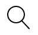 iconMagnifier                          |                iconFileSearch              |                   iconFindReplace                 |                             iconZoomIn                            |                            iconZoomOut                          |
|                                  iconLoupe                                |              iconLoupeZoomIn             |                 iconLoupeZoomOut                |                               iconCross                             |                                iconMenu                               |
|                                   iconList                                  |                       iconList2                      |                            iconList3                          |                               iconMenu2                             |                               iconList4                             |
|                                  iconMenu3                                |              iconExclamation             |                       iconQuestion                      |                               iconCheck                             |                             iconCross2                            |
|                                   iconPlus                                  |                       iconMinus                      |                         iconPercent                       |                         iconChevronUp                       |                      iconChevronDown                    |
|                         iconChevronLeft                       |             iconChevronRight           |  iconChevronsExpandVertical |  iconChevronsExpandHorizontal |  iconChevronsContractVertical |
|  iconChevronsContractHorizontal |                    iconArrowUp                   |                      iconArrowDown                    |                         iconArrowLeft                       |                       iconArrowRight                      |
|                       iconArrowUpRight                      |              iconArrowsMerge             |                   iconArrowsSplit                 |                      iconArrowDivert                    |                      iconArrowReturn                    |
|                                iconExpand                               |                   iconContract                 |                         iconExpand2                       |                         iconContract2                       |                                iconMove                               |
|                                     iconTab                                   |                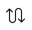 iconArrowWave                |                         iconExpand3                       |                            iconExpand4                          |                         iconContract3                       |
|                       iconNotification                      |                    iconWarning                   |        iconNotificationCircle       |                 iconQuestionCircle                |                       iconMenuCircle                      |
|                   iconCheckmarkCircle                 |              iconCrossCircle             |                    iconPlusCircle                   |                     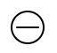 iconCircleMinus                    |                   iconPercentCircle                 |
|                      iconArrowUpCircle                    |        iconArrowDownCircle       |             iconArrowLeftCircle           |              iconArrowRightCircle             |                iconChevronUpCircle              |
|                iconChevronDownCircle              |     iconChevronLeftCircle    |        iconChevronRightCircle       |                 iconBackwardCircle                |                      iconFirstCircle                    |
|                    iconPreviousCircle                   |                iconStopCircle              |                    iconPlayCircle                   |                      iconPauseCircle                    |                       iconNextCircle                      |
|                          iconLastCircle                         |           iconForwardCircle          |                   iconEjectCircle                 |                                iconCrop                               |                      iconFrameExpand                    |
|                      iconFrameContract                    |                       iconFocus                      |                      iconTransform                    |                                iconGrid                               |                      iconGridCrossed                    |
|                                iconLayers                               |           iconLayersCrossed          |                          iconToggle                         |                             iconRulers                            |                               iconRuler                             |
|                                iconFunnel                               |          iconFlipHorizontal        |                 iconFlipVertical                |                iconFlipHorizontal2              |                   iconFlipVertical2                 |
|                                 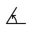 iconAngle                                |                      iconAngle2                    |                       iconSubtract                      |                            iconCombine                          |                         iconIntersect                       |
|                               iconExclude                             |  iconAlignCenterVertical |                    iconAlignRight                   |                      iconAlignBottom                    |                         iconAlignLeft                       |
|          iconAlignCenterHorizontal        |                   iconAlignTop                 |                          iconSquare                         |                       iconPlusSquare                      |                      iconMinusSquare                    |
|                      iconPercentSquare                    |           iconArrowUpSquare          |             iconArrowDownSquare           |                iconArrowLeftSquare              |              iconArrowRightSquare             |
|                   iconChevronUpSquare                 |     iconChevronDownSquare    |          iconChevronLeftSquare        |           iconChevronRightSquare          |                      iconCheckSquare                    |
|                         iconCrossSquare                       |                iconMenuSquare              |                    iconProhibited                   |                             iconCircle                            |                      iconRadioButton                    |
|                             iconLigature                            |                iconTextFormat              |           iconTextFormatRemove          |                          iconTextSize                         |                                iconBold                               |
|                                iconItalic                               |                 iconUnderline                |               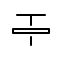 iconStrikethrough              |                         iconHighlight                       |                   iconTextAlignLeft                 |
|                   iconTextAlignCenter                 |          iconTextAlignRight        |           iconTextAlignJustify          |                      iconLineSpacing                    |                 iconIndentIncrease                |
|                    iconIndentDecrease                   |                   iconTextWrap                 |                         iconPilcrow                       |                    iconDirectionLtr                   |                    iconDirectionRtl                   |
|                            iconPageBreak                          |                iconPageBreak2              |                 iconSortAlphaAsc                |                  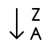 iconSortAlphaDesc                 |                 iconSortNumericAsc                |
|                   iconSortNumericDesc                 |           iconSortAmountAsc          |              iconSortAmountDesc             |                      iconSortTimeAsc                    |                    iconSortTimeDesc                   |
|                                  iconSigma                                |                iconPencilLine              |                             iconHand                            |                         iconPointerUp                       |                    iconPointerRight                   |
|                         iconPointerDown                       |              iconPointerLeft             |                      iconFingerTap                    |                       iconFingersTap                      |                          iconReminder                         |
|                    iconFingersCrossed                   |          iconFingersVictory        |                   iconGestureZoom                 |                    iconGesturePinch                   |    iconFingersScrollHorizontal  |
|          iconFingersScrollVertical        |     iconFingersScrollLeft    |        iconFingersScrollRight       |                               iconHand2                             |                       iconPointerUp2                      |
|                      iconPointerRight2                    |             iconPointerDown2           |                 iconPointerLeft2                |                       iconFingerTap2                      |                      iconFingersTap2                    |
|                            iconReminder2                          |             iconGestureZoom2           |                iconGesturePinch2              |  iconFingersScrollHorizontal2 |     iconFingersScrollVertical2    |
|              iconFingersScrollLeft2             |  iconFingersScrollRight2 |  iconFingersScrollVertical3 |                      iconBorderStyle                    |                         iconBorderAll                       |
|                         iconBorderOuter                       |              iconBorderInner             |                      iconBorderTop                    |              iconBorderHorizontal             |                    iconBorderBottom                   |
|                          iconBorderLeft                         |          iconBorderVertical        |                   iconBorderRight                 |                       iconBorderNone                      |                          iconEllipsis                         |
|                   icon3dGlassesFilled                 |           iconCashGimicoinb          |                 iconCoinGimicoin                |                    iconCardGimicoin                   |                      iconBrainFilled                    |
|                         iconHeartFilled                       |             iconWrenchFilled           |        iconAlarmRingingFilled       |                    iconPlanetFilled                   |                 iconDumbbellFilled                |
|                          iconGameFilled                         |                 iconCardTopup                |                    iconConnection                   |                      iconSmileFilled                    |                         iconHearteyes                       |
|                                iconQrcode                               |                       iconFlash                      |                    iconUserFilled                   |                       iconMap2Filled                      |                                iconInfo                               |
|                            iconPiggybank                          |                                                                                           |                                                                                                    |                                                                                                          |                                                                                                          |